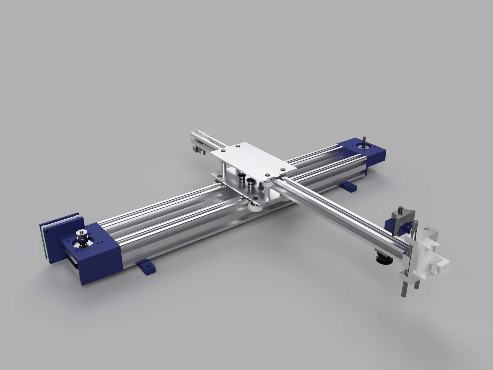
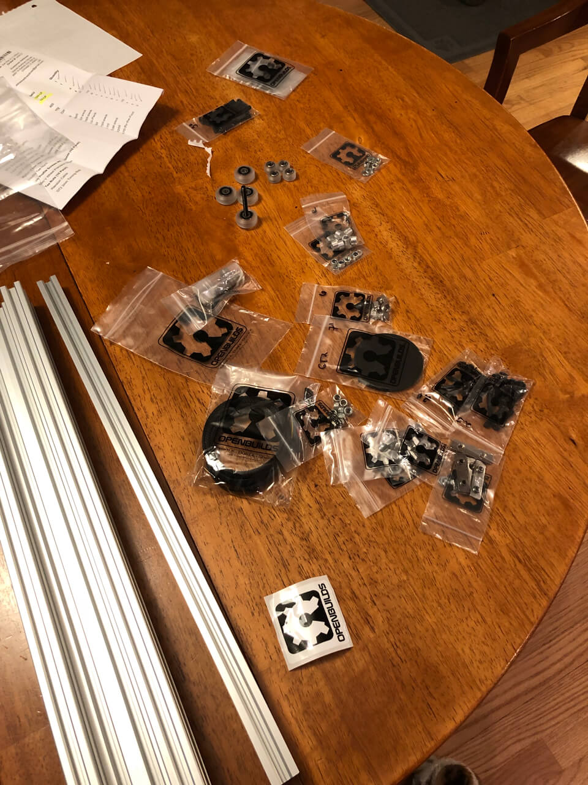
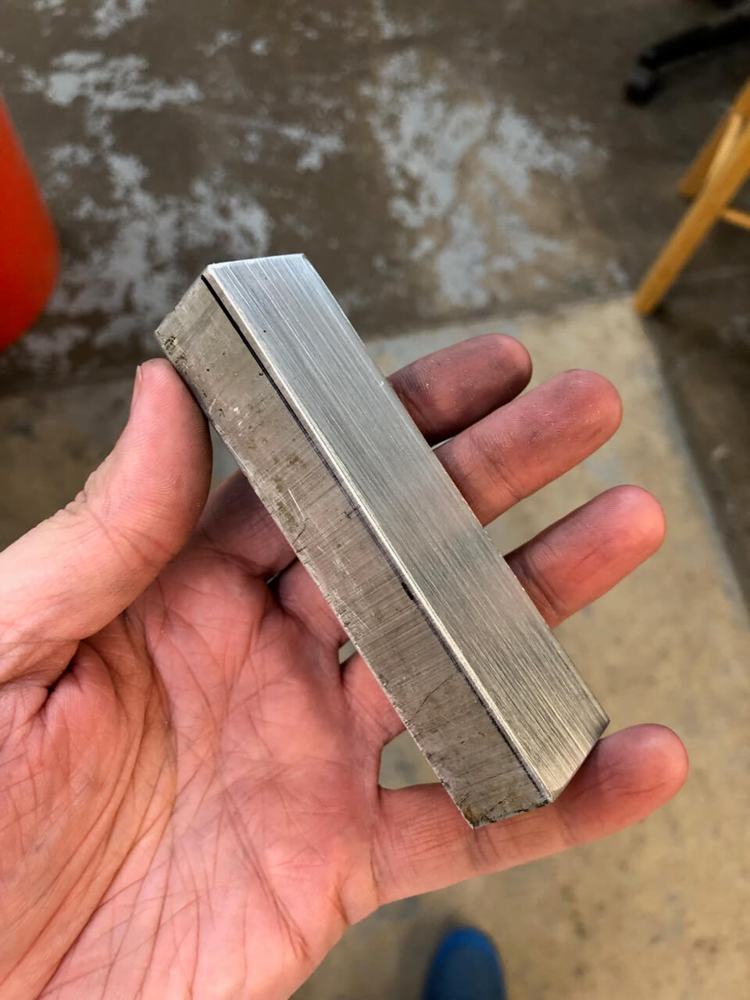
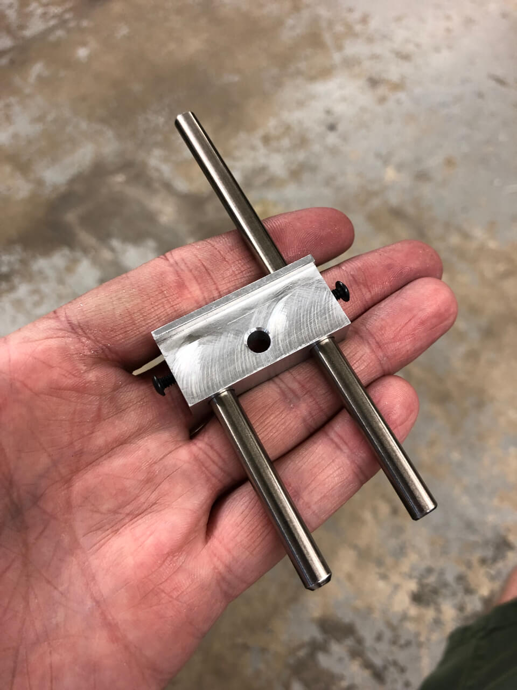
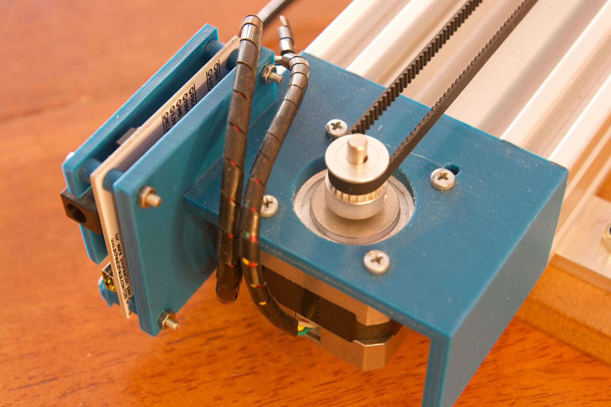

Since I discovered people were playing with pen plotters I got obsessed with this. 
Nowadays we have much faster and reliable printers, but some people like pen plotters because drawings look good with them.
Drawing with a pen over a good quality Bristol paper looks and feels different. Also it is just...  fun!

I decided to build my own. Here are a few pictures and comments about how I did it.

I decided to use the open source [EiBotBoard](https://shop.evilmadscientist.com/productsmenu/188)
from Evil Mad Scientist to control the stepper motors.
There was already some software written for it and I wouldn't have to reinvent the wheel after building everything.

First I modeled almost everything in Fusion 360. Here is a render of it:

Then I got all the main structure from [OpenBuilds](https://openbuildspartstore.com). This part of the plotter is very important for rigidity and accuracy.

And I machined the aluminum carriage out of a block of aluminum.
This part moves the pen up and down and needs to move up and down without
in a straight line with virtually no wobble:

The plotter works as intended and I'm having fun with it,
although I'm thinking in upgrade the pen lifter to make it even more precise.
Here are some pics of it:

