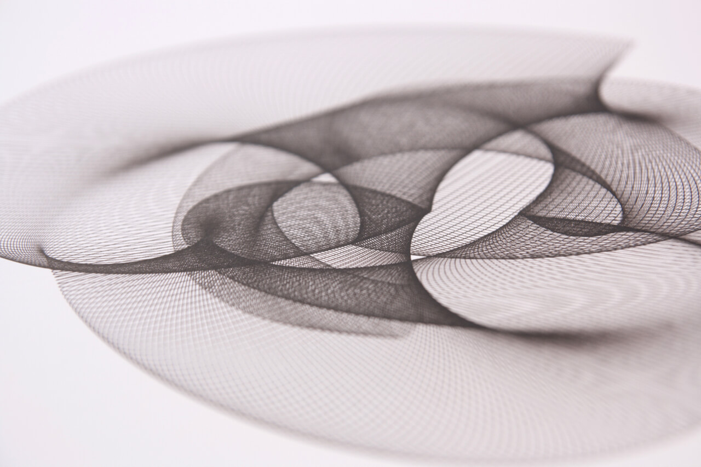

This is pretty much the first plot I made with my plotter. It is a curve related to [Lissajous curves](https://en.wikipedia.org/wiki/Lissajous_curve).

These kinds of curves started to be made with mechanical apparatus called [Harmonographs](https://en.wikipedia.org/wiki/Harmonograph) in mid-19th century. Plotting over nice Bristol paper makes for good looking computer art!
