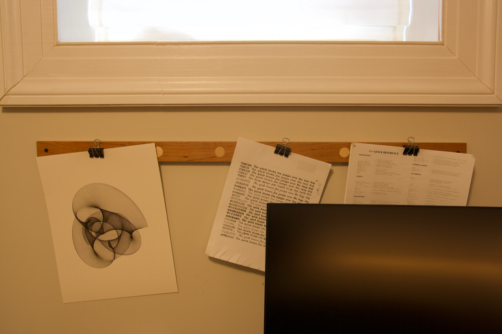
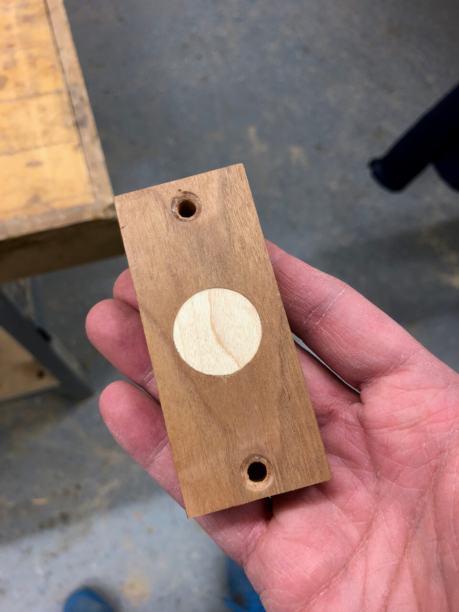
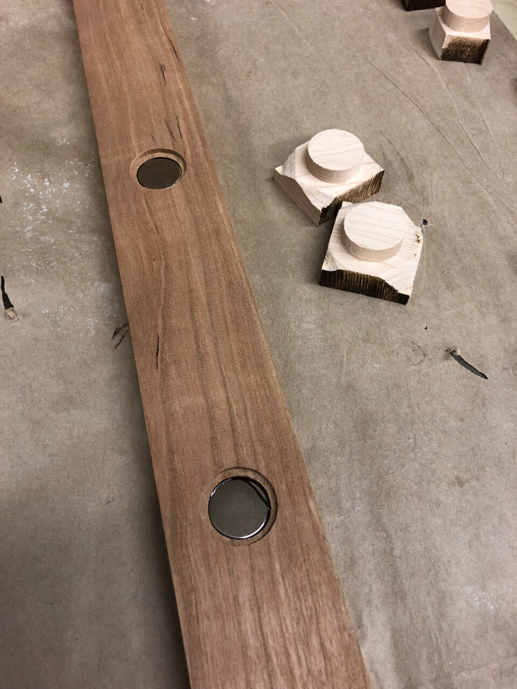
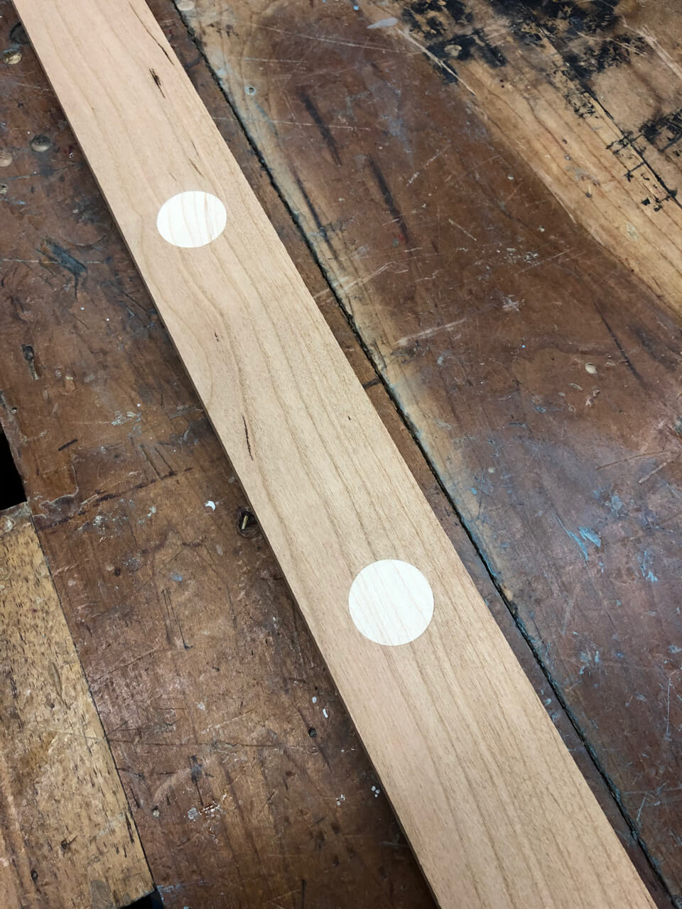
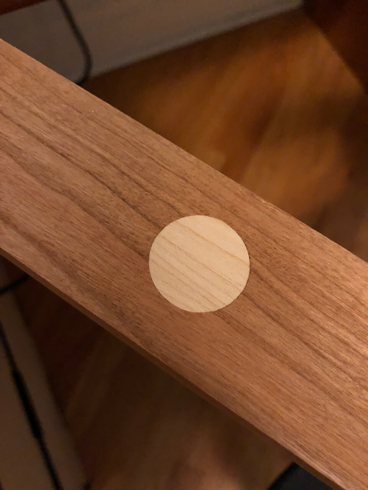
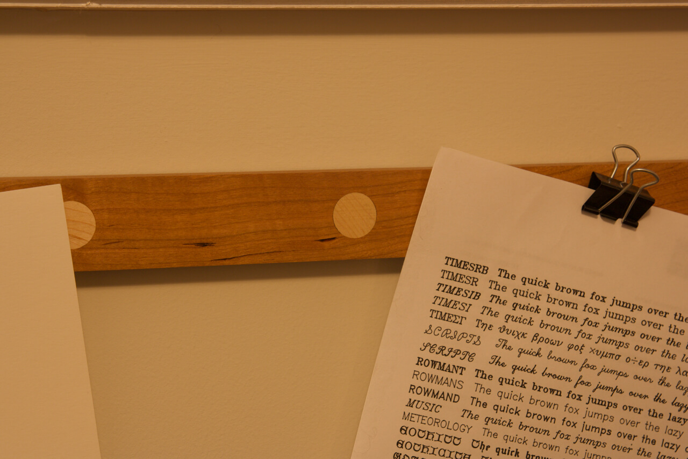

In the picture you can see just a wooden bar with magnets inside that allows me to
hang papers or pictures attached to a binder clip. Either for decoration or to keep
them readily available for reference.

I  made a small version of the bar to test the fit of the maple plug into the cherry bar:

I made holes using a CNC milling machine into a cherry bar to fit strong
neodimium magnets that I glued in place using epoxy. The maple plugs will be glued on
top to hide the magnets.

Here there are the plugs already glued in place but whithout applying any finish
to the wood.

Now I can just get a binder clip in any paper or picture and throw it
at the bar to keep it at sight.
